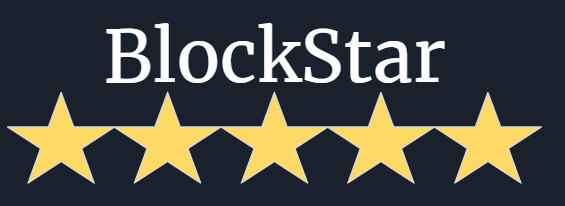

A blockchain-secured trusted review system that analyzes the quality of unverified reviews with NLP.

## Background

Reviews for products online are one of the most useful tools for a consumer to date and you don't need us to tell you why. When something has five out of five stars, it's gotta be good at what it does... right?

Unfortunately, this is not always the case. And the reason is a consequence of the design of the majority of the internet today: one entity can own a service entirely. On a merchant's storefront, they have complete control of the reviews that show up for their products. They may be honorable and leave up criticism, but the customer's trust is in the party that has every interest to deceive them. In Amazon, we find a middle-ground. Since Amazon's storefront is a middle-man between the merchant and customer, the reviews are under Amazon's jurisdiction. However, as we see today, dishonorable merchants can pay for the honors they don't deserve by purchasing bot reviews in mass. This inflates their rating and can trick a customer who sees 10,000 5-star reviews.

In short, it's an issue of **trust**. This is where blockstar comes in.

## Blockchain & Review Scoring

Blockstar has two main components: the Blockstar blockchain and the browser extension. 

When a user opens an online storefront that has reviews (currently only Amazon supported), the browser extension detects this and gives a score for each review using the [ReviewMeta API](https://reviewmeta.com/blog/implement-data-reviewmeta-com-api/) to grade how likely the review was made by a real person. In the future, the extension will also check when a user purchases an item.

And when a user purchases an item, the user is awarded a token on the blockstar blockchain. This token proves that the user bought a product they're leaving a review. In the future, the extension will also flag reviews that have been purchased by users who received a token to prove a verified purchase.

## Goals for the Future

The blockchain and extension has been largely implemented, but there are still work to do. The second part of the extension needs to be implemented where it notifies the blockchain that a new user has purchased the item and needs to be awarded the token on the ledger. 

Currently, the ledger is centralized on Google Cloud, which has the advantage of scaling with use. In the future, the ledger can also be decentralized by running inidividual nodes that verify the integrity of the blockchain. This ensures that no third-party can hijack the system by compromising one system.
